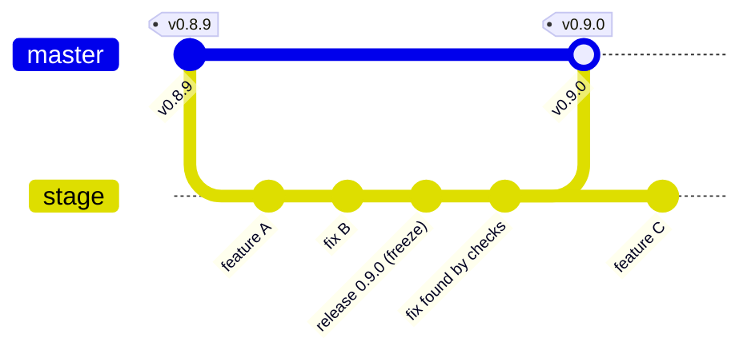

# Releasing Anthill

How changes reach a release: which branch to work on, how a release is frozen
and checked, how it reaches master, and how it is tagged. This is the only
description of the process. [AGENTS.md](AGENTS.md) gives coding agents a short
list of the rules that apply to every task and sends them here for the rest;
if the two ever disagree, this file is right.

## Why master is special

**master is the stable channel.** Linux and Windows users build Anthill from
source on master, and a plugin installed from GitHub runs the MCP server
committed there. macOS ships separately, as the disk image the Release
workflow builds and publishes when a release reaches master. So master only
ever receives a release whose exact commit was checked, or a hotfix, and the
macOS release is tagged on that same master commit: every platform's stable
code is one release.

## Branches at a glance

| Branch | What it is | Starts from | Merges into |
| --- | --- | --- | --- |
| `master` | the latest release, nothing newer | — | — |
| `stage` | the next release, collecting work | master, once | master, as one pull request, merge commit |
| your feature or fix branch | one change | `origin/stage` | `stage`, squash |
| `hotfix/<topic>` | an urgent fix to the released version | master | master, merge commit |
| `sync/<version>` | master brought into `stage` after a hotfix, when they conflict | `stage` | `stage`, merge commit |

`stage` lives for good: it is never renamed, deleted or recreated, and every
release is the same branch merged into master again. It carries no version in
its name because which number the next release gets (patch, minor or major)
is decided only when it is frozen.



`npm run release -- status` prints whether `stage` is open or frozen, its tip,
and whether master holds a hotfix `stage` still lacks.

## Day to day

1. Start from `stage`:

   ```bash
   git switch -c my-change origin/stage
   ```

2. Open the pull request against `stage`, never master. It merges with
   **squash** once `check` passes, so `stage` is always green. A pull request
   into master from any other branch fails the required `release-gate` check,
   and GitHub refuses a direct push to master.
3. Only what can ship goes into `stage`. A feature that is not ready stays in
   its pull request (as a draft if need be); a change in `stage` that turns out
   not to be ready is reverted, not left for the release to wait on.

`stage` is **open** while its `package.json` still carries master's version:
features and fixes go in. It is **frozen** once the release's version bump has
merged: from then on it takes only fixes for what the release's checks found,
and release chores. A feature that misses the freeze waits as a draft pull
request until the release has merged into master.

## Freezing a release

1. **The maintainer chooses the version.** When the release's content is
   complete, the maintainer decides which version `stage` becomes, for
   example 0.9.0. Nobody else picks it — not a contributor, not a coding agent.
2. **The freeze** is the last pull request into `stage` before the release,
   `chore: release X.Y.Z`. It
   sets the version everywhere and rebuilds the plugin bundle. The version, the
   bundle and the release notes are all done here, before anything goes to
   master:

   ```bash
   npm run version:set -- X.Y.Z
   npm install
   npm run plugin:bundle
   ```

   `version:set` writes every workspace `package.json`, the Claude Code plugin
   manifest and its marketplace entry, the Claude Code skill's frontmatter, the
   VS Code plugin manifest and its marketplace entry, and the Codex plugin
   manifest (with a fresh `+codex.<timestamp>` build suffix, which is what
   makes Codex treat a reinstall as new). `apps/mcp/src/versions.test.ts` fails
   if any of them disagree, so a version written by hand is caught.

   `npm run plugin:bundle` builds the MCP server and writes it, with this
   version in its first line, into `server/anthill-mcp.mjs` in every plugin.
   That copy is what a plugin installed from GitHub or a directory runs, so it
   is committed with the release. The same test fails when it is still last
   release's.

The plugin's version tracks the app's release: a plugin-only change ships with
a release, and every release asks installed plugins to update. That is a
choice, made so the two cannot drift apart by accident.

## The release candidate and its checks

1. **The release candidate is one commit**: the branch's tip after the freeze
   merged, named by its full 40-character SHA. Every check is about that commit
   and nothing else; anything run by hand runs on a clean checkout where
   `git rev-parse HEAD` prints that SHA.
2. **Automated checks** run on the release pull request into master (*Moving a
   release into master*), on GitHub's merge of it, whose tree `release-gate`
   requires to be exactly the candidate's: `check`, `linux-source`,
   `windows-source` and `macos-package` (CI). They rerun by themselves when the
   branch is updated. Checks run only on pull requests: a push to `stage` or
   master is the merge of something they already passed. `macos-package`
   builds and signs the macOS disk image with the same steps the Release workflow publishes with
   (`.github/actions/macos-package`), and publishes nothing; its image is the
   run's artefact. These checks are what verifies a candidate.
3. **A bug the checks find** is fixed by a pull request into the branch. The
   new tip is a new candidate, and the release pull request's checks run again
   by themselves.
   Anything else that was run on the old candidate and touches the changed code
   is run again, and the record says what was rerun.
4. **Anything that changes the branch after it was verified** — a fix, a hotfix
   brought in from master, a conflict resolution — makes a new candidate that
   is verified again before it can go to master. `release-gate` enforces this:
   the commit named as verified must be the branch's head.

## What a check proves

Building, automated tests and end-to-end use are different evidence, and one
platform's result says nothing about another. A green macOS CI does not show
that Anthill builds or starts on Linux or Windows; a green `linux-source` does
not show that Anthill works on Linux.

| Evidence | macOS | Linux (supported: CLI) | Windows (experimental) |
| --- | --- | --- | --- |
| Builds | `macos-package` (disk image) | `linux-source`: README steps, `npm run build` | `windows-source`: the same |
| Automated tests | `check`: typecheck and tests on `macos-15` | `linux-source`: `npm test` | not run |
| Starts | not checked automatically | `linux-source`: the CLI serves its page | `windows-source`: the same |
| End to end | only by hand: the desktop app with Codex and Claude Code | only by hand, on a Linux machine | only by hand, on a Windows machine |

Record every cell for the candidate as **passed**, **failed** or **not run**,
and never fill one cell from another. The macOS checks and the Linux build,
tests and start must pass. A Windows failure does not block on its own, but it
is reported and the maintainer decides. End-to-end use is not a required step;
when nobody ran it, the cell says **not run**, and the release is not described
as tested end to end.

## Moving a release into master

1. Open one pull request from `stage` into `master`, titled
   `chore: release X.Y.Z`. Its description has a line
   `` Verified commit: `<40-character SHA>` `` and the evidence table above.
   Public text only: no links to internal trackers or plans.
2. `release-gate` checks that the head is `stage` or a hotfix branch of this
   repository, that its version is higher than master's, that the verified
   commit is the head, and that the merge will be exactly that commit's tree.
   When master holds changes the branch lacks, or they conflict, bring master
   into the branch (*Hotfixes*, step 4), verify the new candidate and update
   the line. Never resolve conflicts in GitHub's editor or on master.
3. The maintainer merges it with **Create a merge commit**, the only method
   master allows. A squash would give master a commit `stage` does not share,
   and the next release would conflict wherever `stage` changed those lines
   again. Only the maintainer merges into master.
4. **The merge publishes it.** The push to master runs the Release workflow,
   and only it. It checks nothing — the pull request passed every check on this
   exact tree — and only publishes. The tag comes from the merged commit's
   `package.json`, which the freeze set: that version has no `vX.Y.Z` tag yet,
   so the workflow builds the macOS disk image again on that master commit,
   tags the commit `vX.Y.Z` and attaches the image to a GitHub release. Nobody
   pushes a tag by hand, so macOS never ships a release master does not have,
   and master never has a release macOS lacks. A push to master whose version
   is already tagged publishes nothing; one whose version is lower than a
   released one fails the workflow.

   To confirm master is the verified tree and see where the release stands:

   ```bash
   npm run release -- landed <verified SHA>
   ```

## After the release

1. **Refresh the installed plugins.** A plugin installed from a directory is a
   copy, not a live mount — nothing refreshes it on its own:

   ```bash
   claude plugin update anthill@anthill
   ```

   and reinstall the Codex plugin from this checkout's marketplace. VS Code
   updates a plugin installed from a marketplace on its own schedule, as it
   does extensions, unless its auto-update is off. Then start new sessions: a
   running session keeps the skill it started with.

   If this step is skipped, the plugin's launcher reports the version it was
   installed at, and the MCP server puts a notice at the top of its
   instructions naming both versions and this command. That only works once
   the installed copy has a launcher new enough to report its version, i.e.
   from the first update after 0.7.8, and only when the plugin runs a
   checkout's server (`~/.anthill/plugin.json` or `ANTHILL_*`). A plugin
   running the server it carries is always the same version as that server,
   so it says nothing about being behind the app.

2. **Nothing else moves.** `stage` stays where it is and is open again as
   soon as master carries its version; the pull requests against it keep their
   base and need no rebase.

## Hotfixes

For a released version that cannot wait for the next release:

1. Branch `hotfix/<topic>` from `origin/master`. Commit the fix with its test,
   then set the version and rebuild the plugin bundle (*Freezing a release*,
   step 2). The maintainer chooses the version here too, usually the next
   patch after master's. If `stage` is already frozen at that number, the
   maintainer chooses a higher one for `stage` and it is frozen again.
2. Verify the hotfix branch's tip like a candidate: the automated checks
   above, on that exact commit.
3. Open a pull request into master as in *Moving a release into master*, with
   its own `Verified commit:` line; the gate, the merge commit, `landed` and
   the release the merge publishes are the same.
4. Bring master into `stage` at once, with a merge commit, never a squash and
   never a rebase of `stage`. `npm run release -- status` warns until it is
   done and prints the command. When they do not conflict, that is a pull
   request from master itself:

   ```bash
   gh pr create --base stage --head master --title "chore: bring vX.Y.Z into stage"
   ```

   When they conflict (usually only the version, if `stage` is frozen), branch
   `sync/<version>` from `origin/stage`, run `git merge origin/master`, keep
   `stage`'s own version where they conflict (rerun `npm run plugin:bundle` if
   it is frozen), and open the pull request from that branch. Either way it is
   merged with **Create a merge commit**. On a frozen `stage` this is a new
   candidate.

   The fix reaches `stage` as master's own commit rather than as a second copy
   of it: one change, one review, and the next release merges into master
   without conflicts. Rebasing `stage` onto master instead would rewrite a
   shared branch — a force push, and every open pull request and checkout
   built on the old commits.

## Tools

| Command | Where | What it does |
| --- | --- | --- |
| `npm run release -- status` | anyone | `stage` open or frozen, its tip; whether master holds a hotfix `stage` lacks, and how to bring it in |
| `npm run release -- landed <sha>` | after the merge into master | checks master is the verified tree and says whether it is published |
| `release.mjs gate` | `release-gate` workflow, pull requests into master | the branch, version, verified commit and merge tree checks above |
| `release.mjs released` | Release workflow, on a push to master | the tag to create and publish, or none when the version is already released |
| `.github/actions/macos-package` | `macos-package` in CI, the Release workflow | builds, signs and checks the macOS disk image |
| `scripts/smoke-cli.mjs` | `linux-source`, `windows-source` | starts the installed CLI and fetches its page, with diagnostics off |

GitHub enforces the rest: master takes pull requests only, merge commits only,
with `check`, `linux-source`, `windows-source`, `macos-package` and
`release-gate` passing; `stage` takes pull requests only, with `check`
passing, and refuses force pushes and deletion.
